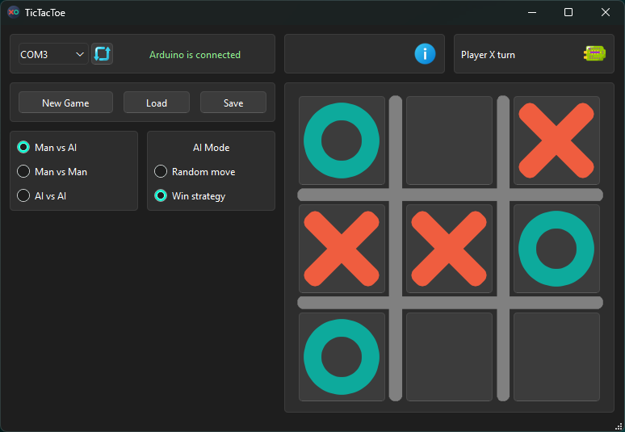

# CSAD 2024-2025 Group KI-410 Ivaniuk Oleh 07

## Project Overview
This repository is created for the Computer Systems Automated Design course. It contains the implementation of assigned tasks using Arduino and C++ for hardware and software development.  
This project is a Qt-based GUI game that interacts with an Arduino server.

## Task Details
- **Student Number**: 07
- **Game**: Tic-Tac-Toe 3x3
- **Configuration Format**: XML
- Play Modes:
	- Man vs AI
	- Man vs Man
	- AI vs AI (Random Move or Win Strategy)

## Technology Stack
Programming Language: C++  
Hardware Platform: Arduino  
Development Tools: Arduino IDE, Qt Framework, Git

---

## Startup instructions

### 1. Preparation of the server part

1. Open **Arduino IDE**.
2. Navigate to the folder `src/arduino/server_lab3/`.
3. Open the file `server_lab3.ino`.
4. Connect your Arduino board to your computer.
5. In the Arduino IDE, select the appropriate board and port (via the `Tools` menu).
6. Upload the code to the board by clicking the `Upload` button.

### 2. Launching the client part

1. **Ready builds**: In the folder `build/lab3_client.rar` you will find ready builds of the client part of the game. You can unzip the archive and run the program without the need to compile.
2. If you want to compile the client yourself:
   - Open **Qt Creator**.
   - Navigate to the folder `src/win/Client_Lab_3/`.
   - Open the client part project (file `lab3.pro`).
   - Compile the project by clicking the `Run` button in Qt Creator.
   - Start the client program.

